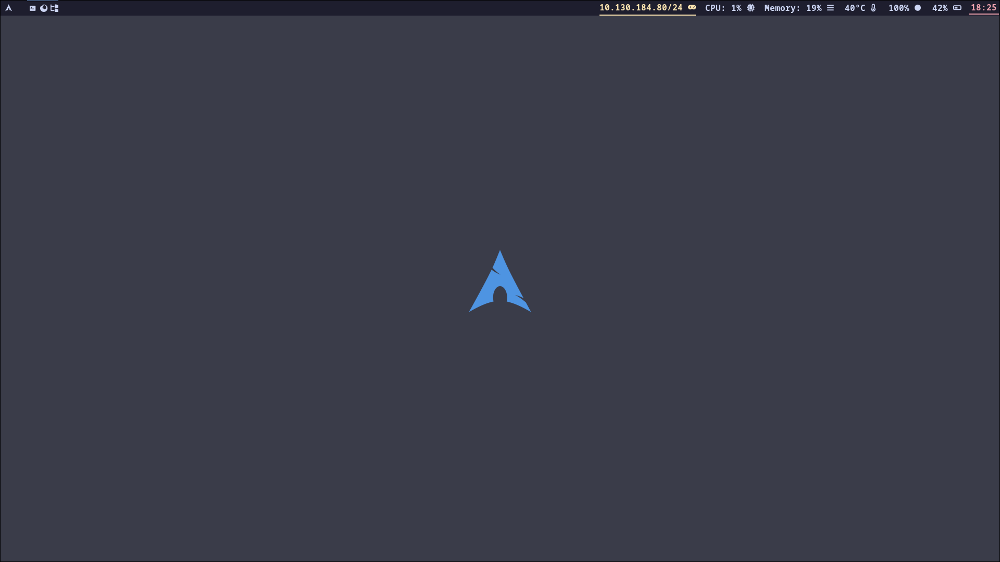

# Arch Linux Hyprland Setup


Modern Arch Linux configuration with Hyprland Wayland compositor, theming, and essential desktop applications.

## Features ✨

- **Hyprland** Wayland compositor setup
- **Waybar** with custom modules
- **SDDM** login manager with theme
- **Kitty** terminal configuration
- **Neovim** IDE-ready setup
- **Theming**: GTK, icons, fonts
- **Essential apps** pre-configured
- **Automatic package management**

## Installation ⚡

1. **Pre-requisites** (base Arch system):

```bash
pacman -S --needed git base-devel
git clone https://github.com/paulbknhs/arch2go
```

2. **Run installer**:

```bash
cd arch2go
./install.sh
```

## Desktop Environment 🖥️



**Key Components**:

- Window Manager: Hyprland
- Status Bar: Waybar
- Terminal: Kitty
- Launcher: Rofi
- Notifications: Dunst
- Theme: Catppuccin Mocha

## Package Groups 📦

| Category       | Components                            |
| -------------- | ------------------------------------- |
| Core System    | Hyprland, Wayland, XDG Portal         |
| GUI Components | Waybar, Rofi, Kitty, Thunar           |
| Applications   | Firefox, VLC, LibreOffice, Blender    |
| Utilities      | Brightnessctl, NetworkManager, Polkit |
| Development    | Neovim, Git, Python, NodeJS           |

## Post-Install 🔧

1. **Enable services**:

```bash
systemctl enable sddm
systemctl enable NetworkManager
```

2. **Configure dotfiles**:

```bash
cp -r config/* ~/.config/
```

3. **Reboot into desktop**:

```bash
systemctl reboot
```

## Customization 🎨

1. **Hyprland config**:

```bash
nvim ~/.config/hypr/hyprland.conf
```

2. **Waybar modules**:

```bash
nvim ~/.config/waybar/config.jsonc
```

3. **Themes**:

```bash
# Edit GTK theme
nvim ~/.config/gtk-3.0/settings.ini
```

## Dependencies ⚠️

- Base Arch Linux installation
- yay AUR helper
- NVIDIA users: `nvidia-dkms` driver

## License 📄

GPL-3.0 License - See [LICENSE](LICENSE)
